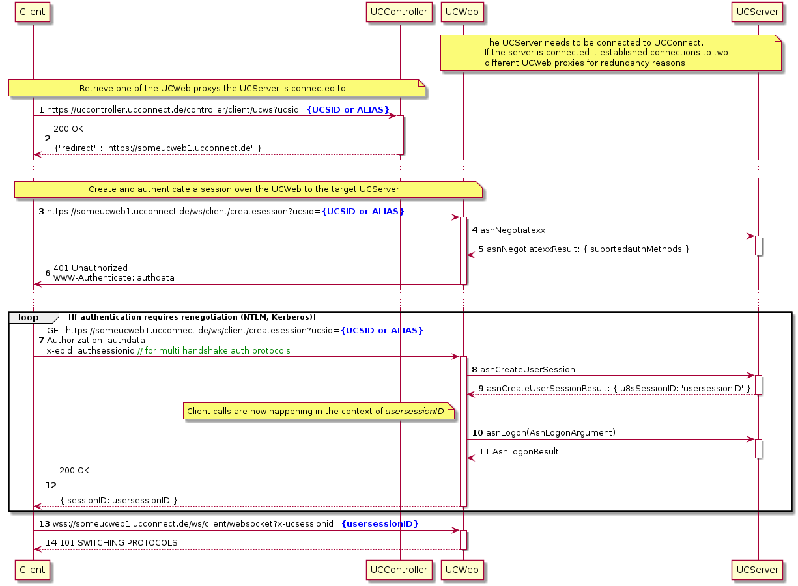

# UCServerWebSDK2.0 *preview*

## Basics
This is a preview version of the estos UCServer Web SDK2.0.
The SDK is currently still in beta status, i.e. we can and will probably make structural changes to simplify and improve the application.

The SDK provides the client and administration communication interface of the UCServer. It is therefore not a separate interface provided for the SDK, but the interface that our products also use.

### Functionality
Communication between a client and the UCServer requires a standing connection. A WebSocket is used for this in the SDK; technically, this can also be a TCP connection.

The interface (structures, methods, events) is described in full in [ASN.1](https://de.wikipedia.org/wiki/Abstract_Syntax_Notation_One). [ROSE](https://en.wikipedia.org/wiki/Remote_Operations_Service_Element_protocol) is used for framing the messages on the standing connection.

The encoding of the messages is either [JSON](https://de.wikipedia.org/wiki/JavaScript_Object_Notation) or [BER](https://en.wikipedia.org/wiki/X.690#BER_encoding), whereby BER allows a much more compact transmission.

### ASN.1 files
The asn.1 files describing the interface are located in the [interface/asn1](interface/asn1) folder. There is a separate asn.1 file for each scope / context. 

Module | Function / Content
-------|-------------------
[ENetROSEInterface.asn1](interface/asn1/ENetROSEInterface.asn1)|Unsorted functions which did not fit into other modules
[ENetUC_Admin.asn1](interface/asn1/ENetUC_Admin.asn1)|Administrative functions which are available on the client interface
[ENetUC_Agent.asn1](interface/asn1/ENetUC_Agent.asn1)|Agent Login Logout state interface
[ENetUC_Appointments.asn1](interface/asn1/ENetUC_Appointments.asn1)|Appointment sync interface  
[ENetUC_Auth.asn1](interface/asn1/ENetUC_Auth.asn1)|Authentication interface
[ENetUC_AV.asn1](interface/asn1/ENetUC_AV.asn1)|Audio Video interface
[ENetUC_BinaryTransfer.asn1](interface/asn1/ENetUC_BinaryTransfer.asn1)|Binary transfer (primarily for chat)
[ENetUC_ChatV2.asn1](interface/asn1/ENetUC_ChatV2.asn1)|Chat interface
[ENetUC_ClientCapabilities.asn1](interface/asn1/ENetUC_ClientCapabilities.asn1)|To exchange client capabilites
[ENetUC_ClientContent.asn1](interface/asn1/ENetUC_ClientContent.asn1)|Favourites layout and structure
[ENetUC_ClientPersistence.asn1](interface/asn1/ENetUC_ClientPersistence.asn1)|Allows a client to store and retrieve data on the server
[ENetUC_Common.asn1](interface/asn1/ENetUC_Common.asn1)|Shared commonly used structures 
[ENetUC_Common_Appointments.asn1](interface/asn1/ENetUC_Common_Appointments.asn1)|Shared appointment structures 
[ENetUC_Common_AsnContact.asn1](interface/asn1/ENetUC_Common_AsnContact.asn1)|Shared contact structures
[ENetUC_Common_Auth.asn1](interface/asn1/ENetUC_Common_Auth.asn1)|Shared auth structures
[ENetUC_Common_SIPCTI.asn1](interface/asn1/ENetUC_Common_SIPCTI.asn1)|Shared sip and cti structures
[ENetUC_CTI.asn1](interface/asn1/ENetUC_CTI.asn1)|Remot call control interface
[ENetUC_Journal.asn1](interface/asn1/ENetUC_Journal.asn1)|Journal / call history interface
[ENetUC_Mgmt.asn1](interface/asn1/ENetUC_Mgmt.asn1)|The server management interface (uses it´s own interface on the server side and thus is not available within the client interface)
[ENetUC_PresenceV2.asn1](interface/asn1/ENetUC_PresenceV2.asn1)|Retrieve and subscribe presence of users (including your own) 
[ENetUC_Ranking.asn1](interface/asn1/ENetUC_Ranking.asn1)|Control the ranking of acd agents
[ENetUC_ServicesAgents.asn1](interface/asn1/ENetUC_ServicesAgents.asn1)|Server to server agent interface
[ENetUC_Tasks.asn1](interface/asn1/ENetUC_Tasks.asn1)|Tasks interface
[ENetUC_Transport.asn1](interface/asn1/ENetUC_Transport.asn1)|Some transport related functions

### From ASN.1 to structures or a complete communication stub
To compile the ASN.1 files, the estos enhanced snacc compiler is located in the [interface/esnacc-compiler](https://github.com/ESTOS/esnacc) folder.
It is built with cmake. For simplification, the 

This can be built using a batch file in the interface folder

The compiler can provide structures for the following programming languages from the ASN.1 files
- C++
- C#
- C
- Swift
- Java
- TypeScript
- Javascript
- Delphi

The compiler provides complete stubs for the following languages.
- C++
- TypeScript

These stubs allow the simple call of the respective other page and offer a virtual interface on the called page for overwriting by means of class derivation.
Corresponding classes are generated for each ASN.1 module, which also enable structured splitting in your own code.
The stub performs the following tasks:
- Complete ROSE handling
- Validation and encoding of a function argument
- Encoding of the ROSE envelope
- Request response association (predefined, optional variable timeout)
- Decoding and validation of incoming requests
- Assignment to registered handler objects
- Complete transport logging (BER and or JSON)
- Encoding decoding in BER and JSON
- Error handling

### Structure of the SDK
Folder | Contents
-------|-------------------
[interface](interface) | Interface, scripts and tooling 
[interface/asn1](interface/asn1) | The ASN.1 files which describe the server interface
[interface/esnacc-compiler](interface/esnacc-compiler) | the esnacc compiler to transpile the ASN.1 files
[openAPI](openAPI) | A swagger ui like client to test functions
[node-client](node-client) | A node sample client

### Connection setup
There are several ways to establish a connection to UCServe as a client.
The simplest and most universal is probably a connection via UCConnect.
It would also be possible to connect directly to an on Premise UCServer or the side by side installed UCWeb but this mechanism is currently not documented here.
If you take a closer look at the following plantUML diagram it should also answer how the direct connection to UCServer or UCWeb are possible.



We plan to provide this connection setup functionality in a dedicated npm module before finally releasing this SDK.

### ROSE messages

Once the connection is established, client and server uses ROSE messages to exchange data. The ROSE protocol supports synchronous invokes and events. The following message types are defined

- Invoke
- Result
- Reject
- Error

An Invoke is used for synchronous calls and creates a result, reject or error. The result is create if the called side was able to process the request. An error is created if the function call failed. In case the argument was not deocdable or the called function is not implemented a reject is returned.

The [core rose messages](interface\esnacc-compiler\ROSE\SNACCROSE.asn1) are also described in asn1.

#### Lets take a look at some example ROSE messages

##### Invoke from the client to the server
(the argument is empty as not beeing relevant)
```json
{
  "invoke": {
    "argument": {}
    "invokeID": 3,
    "operationID": 1510,
    "operationName": "asnCustomNoteSet"
  }
}
```

##### Result from the server to the client
(the result is empty as not beeing relevant)
The result reused the invokeID and thus let´s the caller associate a response with the original invoke. (This allows to implement the request completion logic)
```json
{
  "result": {
    "invokeID": 3,
    "result": {
      "result": {},
      "resultValue": 0
    }
  }
}
```

##### Event from the server to the client
(the argument is empty as not beeing relevant)
Events simply use 99999 as invokeID.
```json
{
  "invoke": {
    "argument": {}
    "invokeID": 99999,
    "operationID": 1511,
    "operationName": "asnUpdateMyCustomNote"
  }
}
```

Messages were shown in JSON. The same applies if BER encoding is used.
The stubs are able to write transport logs in readable notation (also if BER encoding is used). This make diagnosing issues pretty convenient.